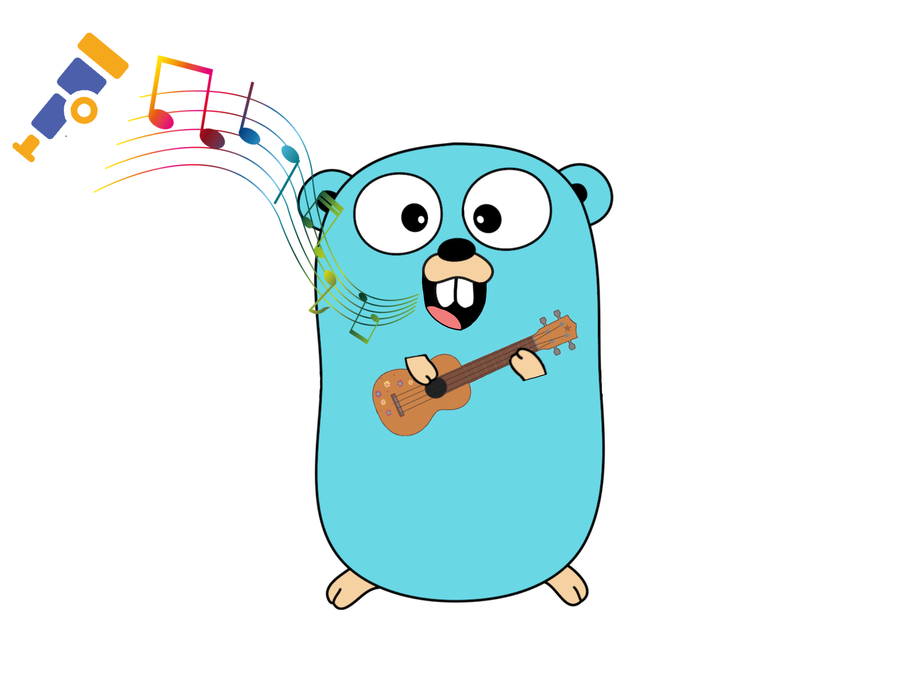

<p align="center">

</p>

Ukulele is an analysis service to quantify source code instrumentation in distributed tracing built on top of [Semgrep](https://github.com/returntocorp/semgrep)

## Disclamer

This project is part of my thesis about quantifying source code instrumentation in distributed tracing. Feel free to contribute via pull requests or to make suggestions for further improvements!
## General Idea

<p align="center">

</p>

First of all, a basis for measurement needed to be defined. In case of distributed tracing, [metrics](/docs/metrics.md) (1) that stand for the quality of source code instrumentation were established. Those metrics reflect correct usage, standards, and coverage when implementing the instrumentation API. Furthermore, they had to been measurable in order to return concrete results. Those results serve as feedback and thus improve the quality of source code instrumentation.

After that, a method to measure the defined metrics needed to be found. An implementation involving static code analysis has the advantage of direct and precise feedback and was therefore chosen. The static code analysis tool needed to support common programming languages in order to be useful in polyglot systems and provide flexibility to specify different kind of rules. Those two preconditions were met by Semgrep (2) where configured rules (3) search code files for certain patterns.

Since the instrumentation API might differ significantly from tracing system vendor to tracing system vendor no matter if the vendor distributes its system commercially or as open source, a rule set for each vendor’s instrumentation API would have been necessary. Fortunately, several vendors saw the need for standardization and have worked together on a unified instrumentation API. The project is called [OpenTelemetry](https://opentelemetry.io/) (4). The defined Semgrep rules are thereby aligned with OpenTelemetry's implementation (other instrumentation APIs are not covered).

Semgrep is not enough to carry out a deeper analysis which includes correlating the results. For that reason, Semgrep’s results are forwarded as JSON over HTTP to a this service called Ukulele (5). Ukulele analyses further the matched code snippets by Semgrep and provides a configuration file so that, depending on the metric, analysis can be adjusted to organizational circumstances. Finally, Ukulele logs (6) its conclusion in structured form to the user. The user (7) can be a developer interested in his or her instrumentation progress or a DevOps engineer checking the overall instrumentation progress. 

Based on the given feedback by Ukulele, the developer responsible for implementing OpenTelemetry can further modify the instrumentation. As soon as those code changes are pushed to the main branch, GitHub Actions (8) automatically executes Semgrep and pushes its results to Ukulele again.

## Setup and Local Deployment (without GitHub Actions)

1. Have a look at the defined [metrics](/docs/metrics.md) to get an better understand of what will be analysed
2. Modify the [configuration file](/custom-config.json) based on your organzational needs by adding the configuration of the respective service
3. Start Ukulele
```
go run ukulele.go setup.go bestpractice.go coverage.go recommendation.go
``` 
4. Copy the [semgrep directory](/semgrep) and its containing files inside your service
5. Replace the service name placeholder in the first rule of [bestpratice.yaml](/semgrep/bestpractice-go.yaml) so that Ukulele knows which service configuration to use
6. Change the language according to the language the service is written in (java or go) inside the [shell script](./semgrep/semgrep_script.sh)
7. Run the shell script (in another terminal window) with localhost and port 8080
```
sh semgrep_script.sh localhost 8080
```  
8. Inspect the results in the terminal window where Ukulele is running  

## Setup and Local Deployment (with GitHub Actions)

1. Have a look at the defined [metrics](/docs/metrics.md) to get an better understand of what will be analysed
2. Modify the [configuration file](/custom-config.json) based on your organzational needs by adding the configuration of the respective service
3. Change the IP address to the IP address assigned to your machine (check your network preferences) in [ukulele.go](/ukulele.go)
4. Start Ukulele
```
go run ukulele.go setup.go bestpractice.go coverage.go recommendation.go
``` 
5. Copy the [semgrep directory](/semgrep) and its containing files inside your service
6. Replace the service name placeholder in the first rule of [bestpratice.yaml](/semgrep/bestpractice-go.yaml) so that Ukulele knows which service configuration to use
7. Change the language according to the language the service is written in (java or go) inside the [shell script](./semgrep/semgrep_script.sh)
8. Change the path to the service and the path to the semgrep file (<pathToService>/semgrep) inside the [shell script](/semgrep/semgrep_script.sh) based on the relative path to your service
9. Copy the [.github directory](/.github) and its containing workflow inside your project
10. Adjust the path inside the [workflow](/.github/workflows/semgrep_check.yaml) based on the relative path to your service
11. Adjust the path inside the [Dockerfile](/semgrep/Dockerfile)'s entrypoint based on the relative path to your service
11. Add the publicly accessable IP and PORT of your machine as secrets inside your project's settings on Github (for more information click [here](https://docs.github.com/en/actions/reference/encrypted-secrets))
12. Push the made code changes to your main branch
13. Inspect the results in the terminal window where Ukulele is running

Examples of such a setup can be found [here](https://github.com/fabenan-f/microservices-demo) by having a look at the adservice (java) and the shippingservice (go).